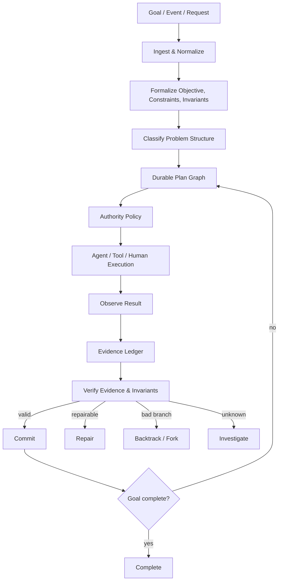

<div align="center">

# AASM
## Algorithmic Agent State Machine

**A deterministic orchestration runtime for AI agents, tools, humans, and multi-agent systems.**

AASM turns open-ended agent behavior into an explicit computational process: state is durable, transitions are legal or illegal, plans are graphs, branches can be rolled back, repeated subproblems can be memoized, scarce resources can be allocated algorithmically, and important claims can be challenged before they are committed.

[](https://github.com/halthinks/AASM/actions/workflows/ci.yml)
[](https://www.python.org/)
[](LICENSE)
[](ROADMAP.md)
[](CONTRIBUTING.md)

[**Quick start**](#quick-start) · [**Downloads**](#downloads) · [**Use cases**](#use-cases) · [**Examples**](#minimal-example) · [**Architecture**](#architecture) · [**Contributing**](CONTRIBUTING.md)

</div>

---

## What is AASM?

Most agent frameworks are very good at giving a model tools. AASM is focused on a different question:

> **How do you govern what an intelligent system is allowed to do next?**

AASM provides a role-agnostic control layer around agents. Models can propose; AASM owns authoritative state, legal transitions, provenance, recovery, durable effects, planning state, memoized subproblems, evidence lineage, and governance.

> **Models propose. Algorithms organize. Policy authorizes. Evidence validates. State governs what happens next.**

AASM is not tied to Planner/Builder. It can coordinate one agent, many specialists, swarms, human approvals, tools, simulators, or external services through the same runtime contracts.

## Core capabilities

| Capability | What AASM does |
|---|---|
| **State machine** | Governs execution through explicit states and legal transitions. |
| **Declarative machines** | Loads custom control graphs and statically checks them before execution. |
| **Durable runtime** | Event-sourced machine state, SQLite persistence, crash recovery, checkpoints, replay, and forks. |
| **Durable effects** | Separates deciding from doing with authorization, idempotency, retries, unknown-outcome reconciliation, and persisted results. |
| **Durable plan graph** | Persists plan nodes, edges, ownership, costs, frontier state, visited work, and pruned branches. |
| **Persistent DP memory** | Reuses solved equivalent subproblems across process restarts with validity scopes and durable invalidation. |
| **Evidence lineage** | Records claims, observations, assumptions, contradictions, derivation links, and invalidation history. |
| **Resource flow** | Uses max-flow/min-cut machinery to reason about constrained agents, tools, and capacity. |
| **Authority policies** | Supports controller, autonomous, quorum, and hierarchical governance models. |

## Architecture



The LLM is **inside** the machine. It is not the machine.

## Quick start

```bash
git clone https://github.com/halthinks/AASM.git
cd AASM
python -m venv .venv
source .venv/bin/activate  # Windows: .venv\Scripts\activate
pip install -e '.[dev]'
pytest -q
```

## Downloads

- **[Download source ZIP](https://github.com/halthinks/AASM/archive/refs/heads/main.zip)**
- **[Download source TAR.GZ](https://github.com/halthinks/AASM/archive/refs/heads/main.tar.gz)**
- **Clone:** `git clone https://github.com/halthinks/AASM.git`

> AASM is currently **v0.5.0 / early-stage**.

## Minimal example

```python
from aasm import AASMEngine, PlanNode, ProblemSpec, SQLiteStore

store = SQLiteStore("runs.db")
engine = AASMEngine(ProblemSpec("Build verified artifact"), store=store)
engine.plan_add_node(PlanNode("research", "task", {"topic": "AASM"}))
engine.memo_put("research-result", {"status": "done"}, scope={"repo": "AASM"})
obs = engine.add_observation("tests passed", source="pytest", confidence=1.0)
claim = engine.add_claim("artifact is locally verified", derived_from=[obs.evidence_id])
print([x.statement for x in engine.evidence_lineage(claim.evidence_id)])
```

## Durable cognition

AASM v0.5 persists the runtime's working cognition in the replayable history:

- plan nodes and edges
- frontier / visited / pruned state
- memoized subproblems and validity scopes
- proof references and durable memory invalidation
- claims, observations, assumptions, contradictions
- derivation, support, and contradiction links
- evidence invalidation history

Historical forks receive exactly the planning, memory, and evidence state that existed at their fork boundary, then diverge independently. External effects are still intentionally not copied into forks.

```bash
aasm plan MACHINE_ID --db runs.db
aasm memory MACHINE_ID --db runs.db
aasm evidence MACHINE_ID --db runs.db
aasm evidence MACHINE_ID --db runs.db --lineage EVIDENCE_ID
```

See [`docs/DURABLE_COGNITION.md`](docs/DURABLE_COGNITION.md).

## Other documentation

- [`docs/DURABLE_RUNTIME.md`](docs/DURABLE_RUNTIME.md) — crash-safe event-sourced runtime
- [`docs/EFFECT_SYSTEM.md`](docs/EFFECT_SYSTEM.md) — durable external-effect lifecycle
- [`docs/DECLARATIVE_MACHINES.md`](docs/DECLARATIVE_MACHINES.md) — declarative control graphs and model checking
- [`docs/REPLAY_FORK.md`](docs/REPLAY_FORK.md) — historical replay and forks
- [`docs/ERICKSON_MAPPING.md`](docs/ERICKSON_MAPPING.md) — algorithmic design mapping

## Use cases

AASM is domain-neutral: agentic software engineering, research/evidence synthesis, CAD and engineering pipelines, multi-agent teams, long-running automation, human-in-the-loop workflows, simulation/optimization, and tool-heavy orchestration.

## Design principles

1. Explicit over implicit.
2. Reversible where possible.
3. Evidence before commitment.
4. Role-agnostic core.
5. Algorithm before improvisation.
6. Authority is separate from capability.
7. Provenance is a feature.
8. No fake determinism.

## Contributing

Contributions are welcome. Please read [`CONTRIBUTING.md`](CONTRIBUTING.md), [`GOVERNANCE.md`](GOVERNANCE.md), [`CODE_OF_CONDUCT.md`](CODE_OF_CONDUCT.md), and [`SECURITY.md`](SECURITY.md).

## Project status

**Current version: `0.5.0` — early-stage / experimental.**

The runtime now includes event-sourced state, SQLite durability, crash/restart recovery, durable external effects, declarative machine definitions, static model checking, historical replay/forking, durable planning state, persistent DP memory, and structured evidence lineage.

See [`ROADMAP.md`](ROADMAP.md).

## Acknowledgements

AASM's algorithmic mapping was inspired by Jeff Erickson's open educational materials on algorithms and models of computation. Those materials are not bundled with this project and remain under their respective terms.

## License

AASM is released under the [MIT License](LICENSE).
